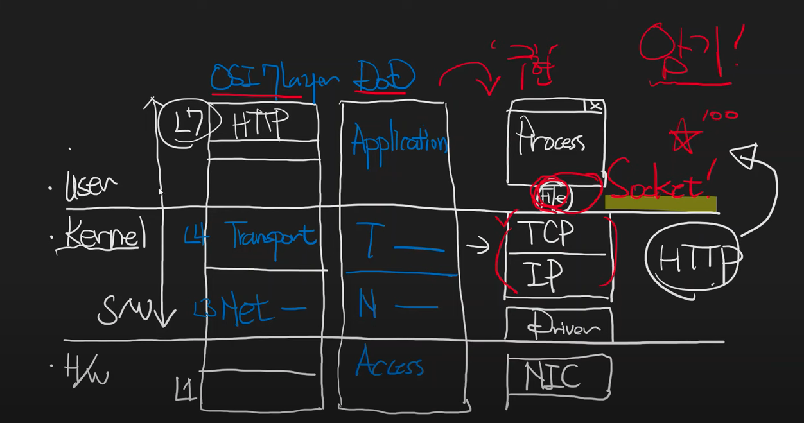

# 네트워크를 배우려는 사람들을 위해

원본 [Youtube](https://www.youtube.com/watch?v=k1gyh9BlOT8&list=PLXvgR_grOs1BFH-TuqFsfHqbh-gpMbFoy&index=1) 링크

1. 개념 vs 사실(구현)
- OSI 7 계층은 명백히 개념의 영역이다
- HTTP, TCP, IP 등은 각 네트워크 계층의 구현

 

2. 컴퓨터 시스템과 DoD 네트워크 4계층
- 네트워크 계층의 분류기준
  - OSI 7 계층은 물리, 데이터링크, 네트워크, 전송, 세션, 표현, 응용
  - DoD 4 계층은 엑세스, 네트워크, 전송, 응용 계층으로 구성
- 네트워크 계층의 구현
  - 최하위 계층(Access) : Network Interface Card
  - NIC Driver
  - 네트워크 계층 : IP Protocol
  - 전송 계층 : TCP Protocol
  - Socket : TCP의 추상체 (File 인터페이스)
  - 최상위 계층(Process)

