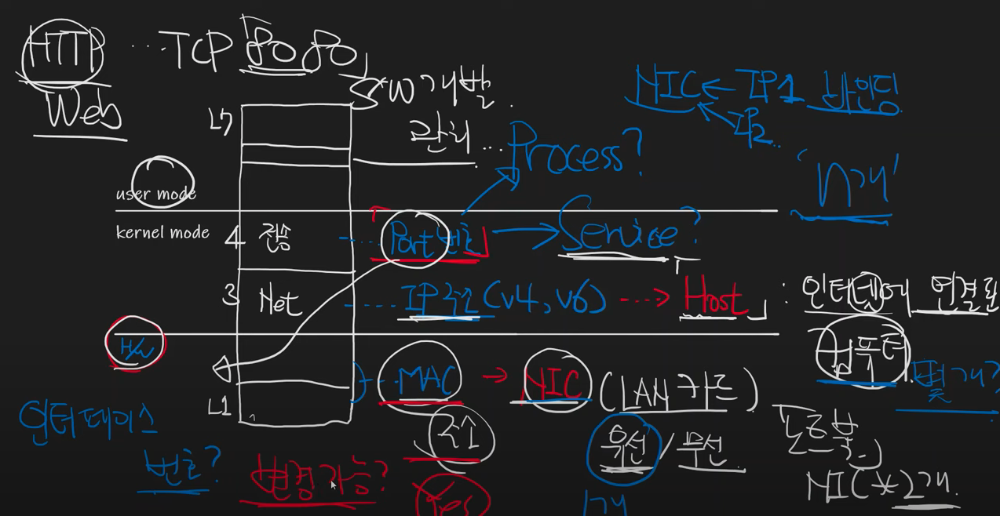

# MAC주소, IP주소, Port번호가 식별하는 것

원본 [Youtube](https://www.youtube.com/watch?v=JDh_lzHO_CA&list=PLXvgR_grOs1BFH-TuqFsfHqbh-gpMbFoy&index=2) 링크

- MAC 주소가 식별하는 것
    - MAC은 물리 주소
    - 하드웨어 즉, NIC 또는 LAN카드를 식별
    - 변경가능
- IP 주소가 식별하는 것
    - IP 주소는 논리 주소
    - **바인딩**된 하나의 "호스트"
        - 호스트는 하나의 NIC에 N개 바인딩하여 사용할 수 있음
- PORT 번호가 식별하는 것
    - 상위 : Process?
        - 네트워크 애플리케이션 프로세스는 일반적으로 하나의 포트를 이용해 통신
        - 여러개의 프로세스가 동일한 포트로 통신할 수 없음
    - 중위 : Service?
        - 인/아웃 바운드 규칙을 설정할 때 일반적으로 포트번호의 대명사로 서비스 이름을 사용
        - 예) HTTP/80, FTP/21
    - 하위 : Interface?
        - 물리적 포트를 의미

